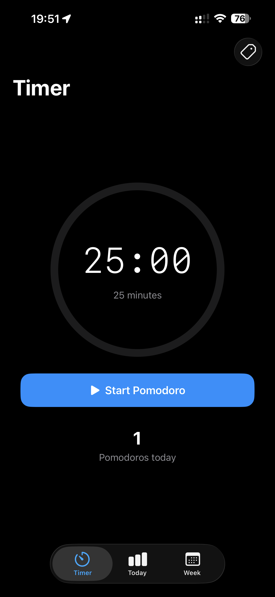
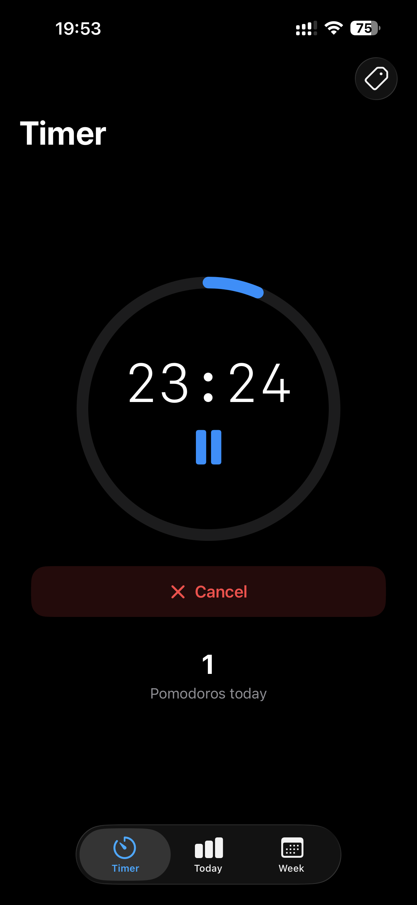
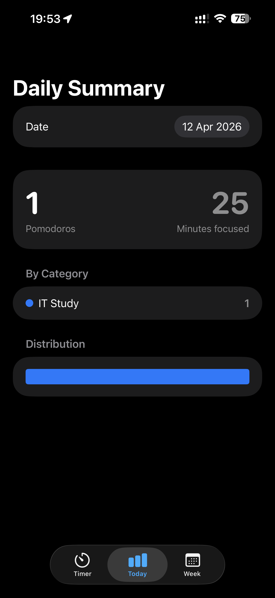
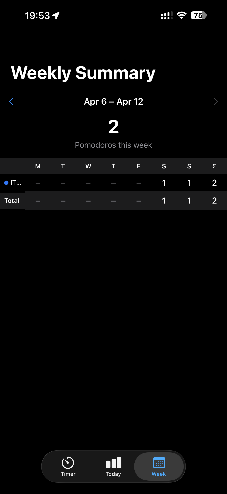

# Pomodoro

## Screenshots

| Timer | Running | Daily Summary | Weekly Summary |
|-------|---------|---------------|----------------|
|  |  |  |  |

## Development

### Debug environment variables

Set in Xcode: **Product > Scheme > Edit Scheme… > Run > Arguments > Environment Variables**.
Only honoured in `DEBUG` builds.

| Variable | Effect |
|----------|--------|
| `POMODORO_DURATION` | Override the 25-minute timer with the given number of seconds (e.g. `15` for fast iteration). Defined in [TimerViewModel.swift](Pomodoro/Pomodoro/ViewModels/TimerViewModel.swift). |
